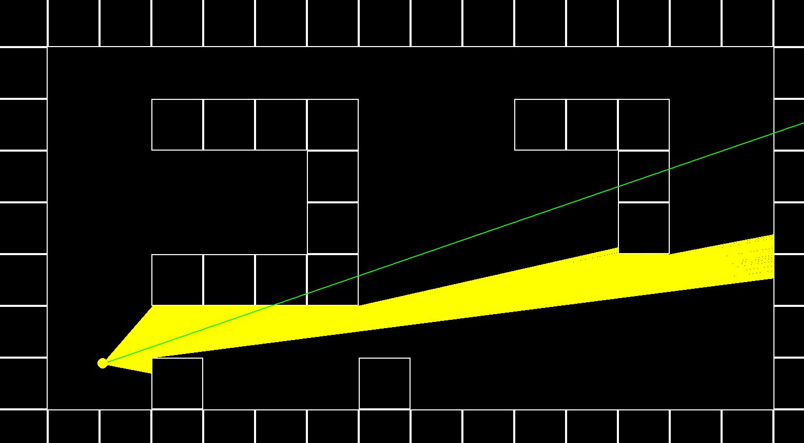
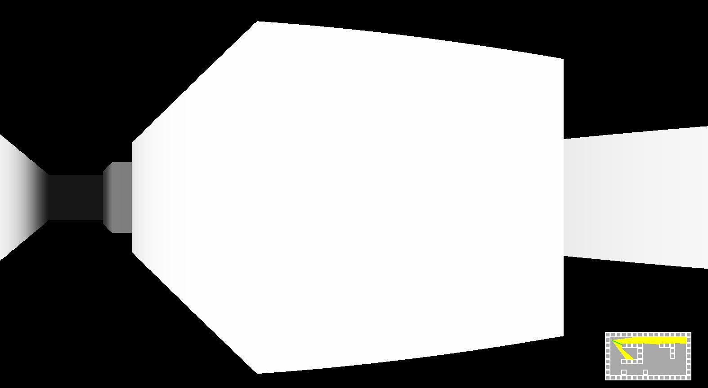
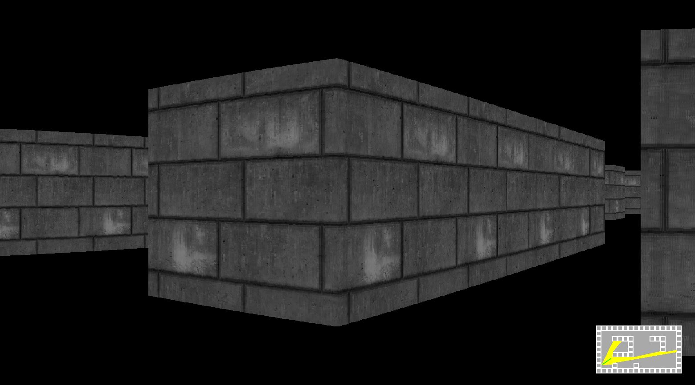

# Overview

These are some experiments in game development in 2D and 2.5D as per [the excellent youtube tutorial](https://www.youtube.com/watch?v=ECqUrT7IdqQ) by [the awesome  Stanislav Petrov](https://github.com/StanislavPetrovV)

# Running the game

To run the game in 2D, run the following command in the command line:

## 2D

`python main.py -d 2`.

To run the game in 3D (or "2.5D"), run

## 3D

`python main.py -d 3`

To run the game in 3D (or "2.5D") with texture rendering, run

`python main.py -d 3 -r`

