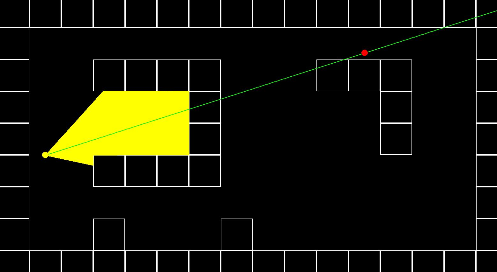

# Overview

These are some experiments in game development in 2D and 2.5D as per [the excellent youtube tutorial](https://www.youtube.com/watch?v=ECqUrT7IdqQ) by [the awesome  Stanislav Petrov](https://github.com/StanislavPetrovV)

# Running the game

The following command line args are available to configure the game mode:

```bash
PS C:\Users\bettmensch\GitReps\doom-python> python main.py --help
pygame 2.5.2 (SDL 2.28.3, Python 3.11.8)
Hello from the pygame community. https://www.pygame.org/contribute.html
usage: main.py [-h] [-d {2,3}] [-c {m,k}] [-r]

Run game in 2D or 3D, toggle texture rendering and controls.

options:
  -h, --help            show this help message and exit
  -d {2,3}, --dimension {2,3}
                        Dimensions in game.
  -c {m,k}, --control-rotation {m,k}
                        Whether to turn using left/right arrow keys, or the mouse.
  -r, --render-textures
                        Toggle texture rendering on/off. Only relevant in 3D.
```


## **2D**

To run the game in `2D` using the mouse to turn left/right, run

`python main.py -d 2 -c m`.



To run the game in `2D` using the LEFT/RIGHT arrow keys to turn left/right, respectively, run

`python main.py -d 2 -c k`.


## **3D**

To run the game in `3D` (or "`2.5D`") without texture rendering (and with mouse turning controls), run

`python main.py -d 3`


To run the game in `3D` (or "`2.5D`") with texture rendering (and with mouse turning controls), run

`python main.py -d 3 -r`


Add the `-c k` flag to the above commands to switch to LEFT/RIGHT arrow key turning controls.