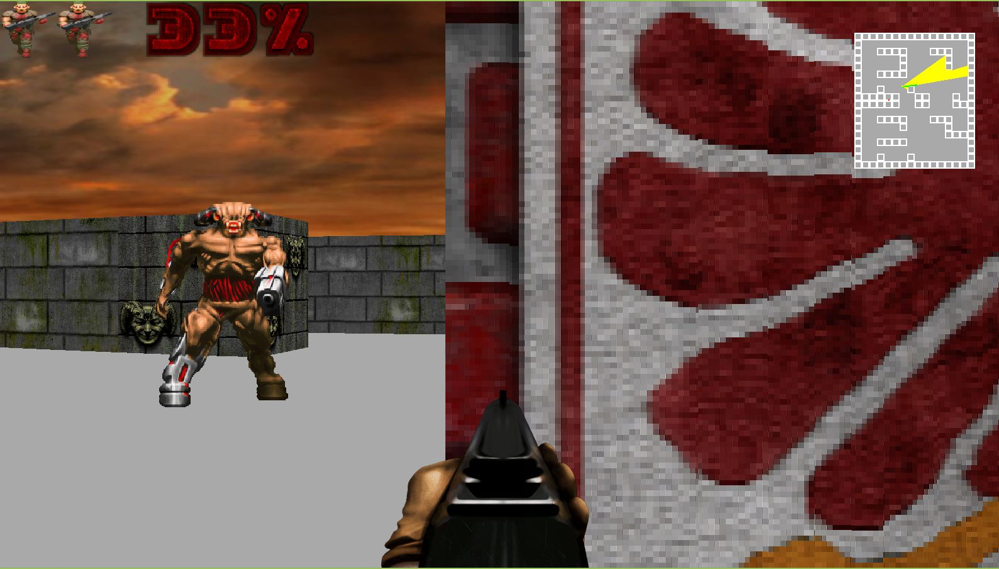

# Table of contents

1. [Overview :sunrise_over_mountains:](#overview-sunrise_over_mountains)
2. [Quickstart :rocket:](#quickstart-rocket)
3. [Controls :video_game:](#controls-video_game)
4. [Running the game :clapper:](#running-the-game-clapper)

# Overview :sunrise_over_mountains:

These are some experiments in game development in 2D and 2.5D as per [the excellent youtube tutorial](https://www.youtube.com/watch?v=ECqUrT7IdqQ) by [the awesome  Stanislav Petrov](https://github.com/StanislavPetrovV)

# Quickstart :rocket:

This game was developed and tested using python `3.11.8`.

To install the python dependencies, run

```bash
pip install -r requirements.txt
```

To run the game, run

```bash
python main.py
```


# Controls :video_game:

## Movement :running:

The player moves forward, backward, strides left and right using the `W`, `S`, `A` and `D` keys, respectively.

Note that in `2D`, the keys are locked onto the up, down, left and right directions on the screen regardless of the player's orientation on screen, whereas in `3D` these are all relative to the players orientation.

## Turning :arrows_counterclockwise:

By default, the player turns (i.e. changes orientation) using the mouse. If configured (see below sections), you can instead use the `LEFT` and `RIGHT` arrow keys.

## Shooting :dart:

By default, the player shoots using the left mouse button. If configured (see below sections), you can instead use the `SPACEBAR`.

# Running the game :clapper:

The following command line args are available to configure the game mode:

```bash
PS C:\Users\bettmensch\GitReps\doom-python> python main.py --help
pygame 2.5.2 (SDL 2.28.3, Python 3.11.8)
Hello from the pygame community. https://www.pygame.org/contribute.html
usage: main.py [-h] [-d {2,3}] [-ts {m,k}] [-l {1,2,3}]

Run game in 2D or 3D, toggle texture rendering and controls.

options:
  -h, --help            show this help message and exit
  -d {2,3}, --dimension {2,3}
                        Dimensions in game.
  -ts {m,k}, --turn-shoot {m,k}
                        Whether to turn and shoot using left/right arrow keys and space bar, or the mouse.
  -l {1,2,3}, --level {1,2,3}
                        Select a level to play. Defaults to first level (1).
```


## **2D** :two:

**WARNING: This game mode is experimental and doesnt have full playability yet.**

To run 

- the first level of the game,
- using mouse controls for turning and shooting

in `3D` (or "`2.5D`") , run

```bash
python main.py -d 2 -ts m -l 1
```


To run 

- the first level of the game,
- using keyobard controls for turning and shooting

in `3D` (or "`2.5D`") , run

```bash
python main.py -d 2 -ts k -l 1
```


## **3D** :three:

To run 

- the second level of the game,
- using keyobard controls for turning and shooting

in `3D` (or "`2.5D`") , run

```bash
python main.py -d 3 -ts k -l 2
```

